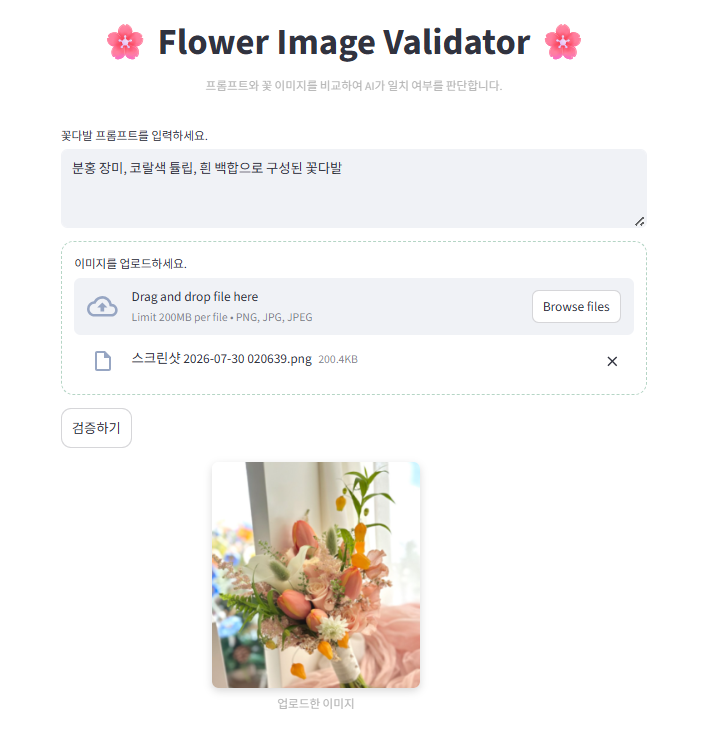
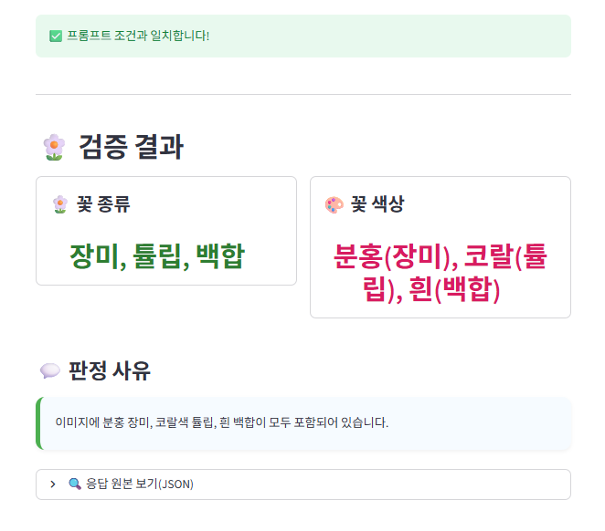
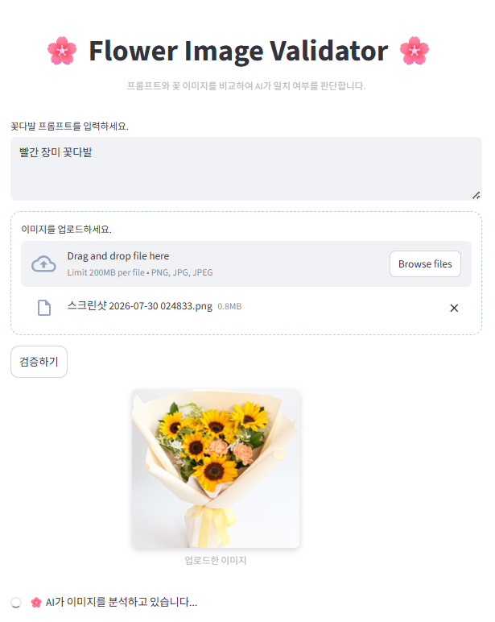
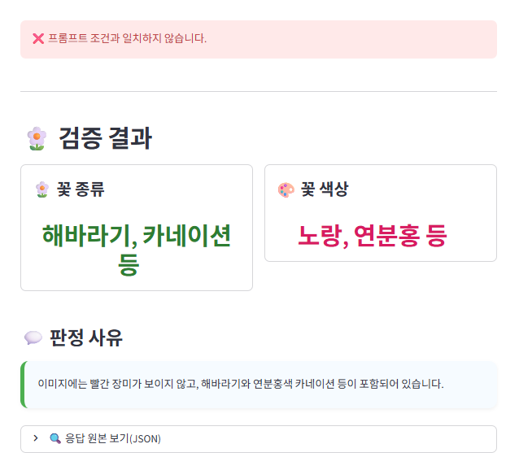
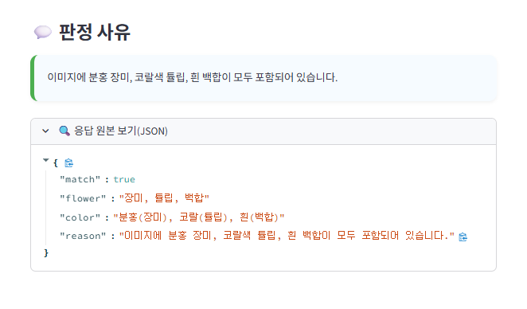

# 🌸 Flower Image Validator

## 📌 프로젝트 소개
OpenAI Vision API를 활용하여 꽃 이미지와 사용자가 입력한 프롬프트를 비교하고, 일치 여부를 판단하는 AI 기반 웹 애플리케이션입니다.

---

## ✨ 주요 기능

- 🌼 꽃 이미지 업로드
- 📝 꽃다발 프롬프트 입력
- 🤖 OpenAI Vision API를 이용한 꽃 종류 및 색상 분석
- ✅ 프롬프트와 이미지의 일치 여부 판별
- 💬 판정 사유 제공
- 📄 AI 응답(JSON) 확인

---

## 🛠️ 기술 스택

- Python
- Streamlit
- OpenAI API (GPT-4.1-mini)
- Base64 Image Encoding

---

## 📂 프로젝트 구조

```
flower-image-validator
│
├── src
│   ├── main.py
│   ├── validator.py
│   └── prompt.py
│
├── requirements.txt
├── .gitignore
└── README.md
```

---

## ▶️ 실행 방법

## 1. 프로젝트 다운로드

```bash
git clone https://github.com/heewonjung2/flower-image-validator.git
cd flower-image-validator
```

---

## 2. 가상환경 생성 (권장)

```bash
python -m venv .venv
```

### Windows

```bash
.venv\Scripts\activate
```

### macOS / Linux

```bash
source .venv/bin/activate
```

---

## 3. 라이브러리 설치

```bash
pip install -r requirements.txt
```

---
## 4. OpenAI API Key 설정

프로젝트 루트에 `.env` 파일을 생성한 뒤 아래 내용을 입력합니다.

```text
OPENAI_API_KEY=YOUR_API_KEY
```

---

## 5. 프로그램 실행

```bash
streamlit run src/main.py
```

---

## 📷 실행 화면

### 1. 메인 화면

이미지를 업로드하고 꽃다발 프롬프트를 입력하면 AI가 분석하여 결과를 제공합니다.


프롬프트를 입력하고 꽃 이미지를 업로드합니다.



---

### 2. 검증 성공

프롬프트와 이미지가 일치하는 경우입니다.



---

### 3. 검증 실패

프롬프트와 이미지가 일치하지 않는 경우입니다.




---

### 4. JSON 응답 확인

Vision API의 원본 응답을 확인할 수 있습니다.


